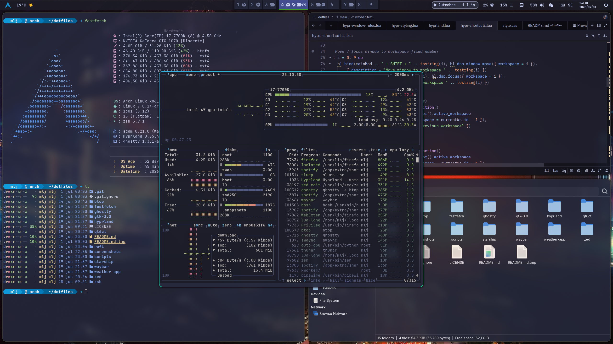
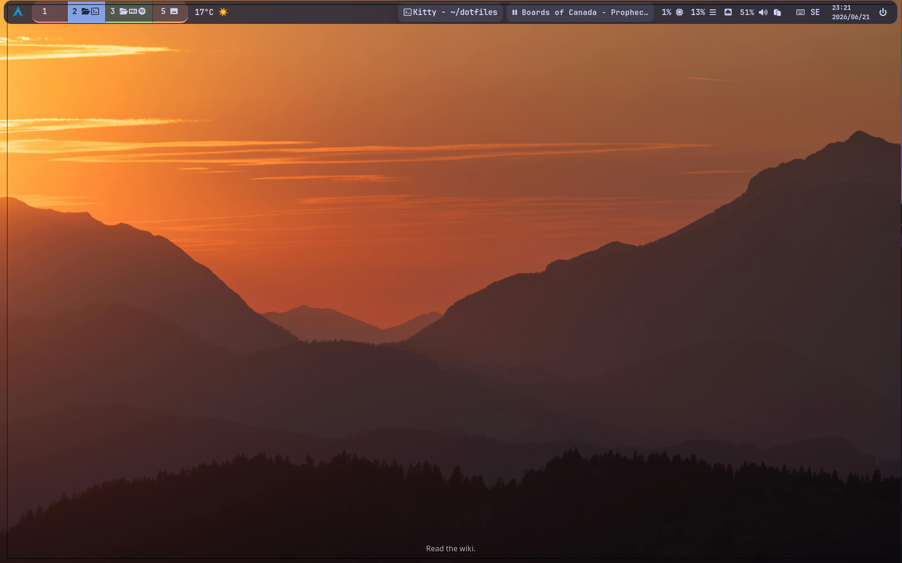

<h1 align="center"> Muramasa's Dotfiles </h1>

<p align="center"> 
I've always enjoyed the Catppuccin Macchiato color palette, and really wanted to use it for my desktop environment. This is my personal configuration for Arch Linux runningcc the Hyprland tiling window compositor. Using Catppuccin Macchiato color palette, these dotfiles aim for a clean workflow without compromising on aesthetics. </p>

<h2 align="center"> What You'll Find Here </h2>
<p align="center"> 
These configurations cover the complete desktop experience—from window management and terminal emulation to status bars, notification systems, and application defaults. Everything here is built around a practical approach, using practical tools with consistent visuals across the environment. </p>

<p align="center"> My personal configuration files for <b>Arch Linux</b> with <b>Hyprland</b> compositor, featuring <b>Catppuccin Macchiato</b> theming. </p>

<p align="center">
	
	
	
	
	
	
</p>


<p align="center">
  
  
</p>

## Overview

⚠️ **WIP**

This is an early work-in-progress. Configs may be incomplete, and the install script may not work correctly on all systems. Not recommended for use yet.

## Tech Stack

<p align="center">


">


</p>
This repository contains my complete desktop environment configuration including:


<details>
<summary><b>📋 Detailed Overview</b></summary>

| Component | Description |
|-----------|-------------|
| **Hyprland** | Tiling Wayland compositor with animations |
| **Waybar** | Status bar with custom modules (weather, clock, system stats) |
| **Rofi** | Application launcher, clip history, power menu, SUPER+TAB dmenu replacement |
| **Ghostty** | Modern GPU-accelerated terminal emulator |
| **Zsh** | Shell with Starship prompt |
| **Zed** | Modern editor, made in Rust |
| **Thunar** | File manager |
| **Catppuccin** | Unified color theme across GTK, Qt, and terminals |

</details>


## Themes & Assets

This configuration uses the following third-party assets:

- **Catppuccin Theme Suite** - [github.com/catppuccin](https://github.com/catppuccin)
  - GTK themes (`gtk-Catppuccin`)
  - Qt5ct theme (`qt5t-Catppuccin`)
  - Rofi theme (`rofi-catppuccin`)
  - Zed theme (`zed-catppuccin`)
  - Ghostty theme (`Ghostyy-catppuccin`)

- **rofi-power-menu** - [github.com/jluttine/rofi-power-menu](https://github.com/jluttine/rofi-power-menu)

## Directory Structure

```bash
~/dotfiles/
├── btop             # btop config
├── fastfetch        # Fastfetch config
├── gtk-3.0/         # gtk config / themes
├── hyprland/        # Hyprland config (hyprland.lua)
├── kitty/           # Kitty terminal config
├── qt6ct/           # qt6 config / themes
├── rofi/            # Rofi config
├── screenshots/     # Screenshots
├── scripts/         # Custom scripts
├── starship/        # Starship prompt config
├── waybar/          # Waybar config, style.css, scripts
├── weather-app/     # Custom weather script + config
├── zed /            # Zed config / themes
└── zsh/             # .zshrc shell config
```

## Installation

### Option 1: Using install.sh (Recommended)

Run the following commands to install the dotfiles using the `install.sh` script:

```bash
git clone git@github.com:Muramasa500/muramasa500-hyprland-dotfiles~/	dotfiles
cd ~/dotfiles/scripts
chmod +x install.sh
./install.sh
```

### Option 2: Using GNU Stow 

```bash
git clone git@github.com:Muramasa500/muramasa500-hyprland-dotfiles~/	dotfiles
sudo pacman -S stow
cd ~/dotfiles
stow fastfetch gtk-3.0 hyprland kitty qt6ct rofi starship waybar weather-app zed zsh
```


### Option 3: Manual Setup
```bash
cp -r btop/.config/* ~/.config/
cp -r fastfetch/.config/* ~/.config/
cp -r gtk-3.0 /.config/* ~/.config/
 ... repeat for other folders
```


## Key Features

- Weather Display: Open-Meteo API integration with 3-day forecast
- Clipboard Manager: Cliphist integration for history
- Power Menu: Shutdown, reboot, suspend, hibernate, logout
- Application launcher: Start an application from a menu
- A window switcher: Start a ALT-TAB style window switcher 
- Multi-Monitor: Optimized for 3 displays
- NVIDIA Support: GTX 1070 drivers configured
- Language Switcher: Select keyboard layout


## Keyboard Shortcuts

| Keybinding | Action |
|------------|--------|
| `Super + A` | Open rofi application launcher|
| `Super + ENTER` | Open kitty terminal |
| `Super + B` | Open firefox browser |
| `Super + Z` | Open Zed editor |
| `Super + Q` | Close focused window |
| `Super + Arrow` | Move focus to a new window |
| `Super + Shift + Arrow` | Move focused window to new workspace |
| `Super + 1 ... 9` | Move to workspace  1 .. 9 |
| `Super + Tab` | Open Rofi window switcher |
| `Super + F` | Full screen |

*(Check `~/.config/hypr/hypr-shortcuts.lua` for full list)*


## Important Notes

Files NOT in this repo (ignored):
- weather-app/geolocation (GPS coordinates for weather app)


## Post-Clone Configuration

After cloning, you must:
1. Create ~/.config/weather-app/geolocation with your own coordinates.
2. Get rofi-power-menu:
```bash
sudo curl -o /usr/local/bin/rofi-power-menu https://raw.githubusercontent.com/jluttine/rofi-power-menu/master/rofi-power-menu
sudo chmod +x /usr/local/bin/rofi-power-menu
```

## Dependencies

Install required packages:

```bash
sudo pacman -S \
  hyprland xdg-desktop-portal-hyprland hyprpolkitagent hyprlock \
  hypridle hyprpaper hyprshot hyprsunset cliphist wl-clipboard xclip btop \
  waybar rofi-wayland kitty swaync gnome-keyring libsecret \
  zsh starship jq curl playerctl pavucontrol \
  gvfs-mtp glib-networking polkit-gnome \
  networkmanager network-manager-applet \
  thunar thunar-archive-plugin thunar-media-tags-plugin \
  thunar-vcs-plugin thunar-volman neovim \
  zsh-autosuggestions zsh-history-substring-search \
  zsh-syntax-highlighting slurp eza dust fd bat \
  ripgrep procs fzf zoxide btop thunar direnv zed \
  qalculate-gtk brightnessctl fastfetch
  ```

## ⚠️ Hardware Notes

- **GPU:** NVIDIA GTX 1070
  - Uses `nvidia-550xx-dkms` from AUR (newer drivers cause issues)
- **Input:** Logitech wireless keyboard/mouse via single Bolt USB receiver
- **Displays:** 3 monitors
- **Network:** Ethernet (no WiFi configured)
-

## Credits

#### Hyprland Ecosystem Tools
- [Hyprland](https://github.com/hyprwm/Hyprland) - Wayland compositor
- [HyprIdle](https://github.com/hyprwm/hypridle) - Session idle management
- [HyprLock](https://github.com/hyprwm/hyprlock) - Screen locking
- [HyprPaper](https://github.com/hyprwm/hyprpaper) - Wallpaper management
- [XDG Desktop Portal Hyprland](https://github.com/hyprwm/xdg-desktop-portal-hyprland) - Integration layer
- [HyprShot](https://github.com/Gustash/hyprshot) - Screenshot utility

#### Core Applications
- [Waybar](https://github.com/Alexays/Waybar) - Status bar
- [Rofi](https://github.com/davatorium/rofi) - Application launcher
- [Kitty](https://github.com/kovidgoyal/kitty) - GPU-accelerated terminal
- [Zed](https://github.com/zed-industries/zed) - Rust-based text editor
- [Thunar](https://docs.xfce.org/apps/thunar/start) - XFCE file manager
- [Rofi-wayland](https://github.com/lbonn/rofi) - Wayland-compatible rofi fork
- [SwayNC](https://github.com/ErikReider/SwayNotificationCenter) - Notification daemon

#### Themes / assets
- [Catppuccin](https://github.com/catppuccin) - Color themes
- [JetBrains Mono Nerd Font](https://github.com/ryanoasis/nerd-fonts) - Icon/font patching
- [Jluttine/Rofi-Power-Menu](https://github.com/jluttine/rofi-power-menu) - Power menu script

#### Utilities
- [Cliphist](https://github.com/chromey/cliphist) - Clipboard history manager
- [Btop](https://github.com/arista-nos/btop) - Resource monitor
- [Fastfetch](https://github.com/fastfetch-cli/fastfetch) - System information display
- [Starship](https://github.com/starship/starship) - Cross-shell prompt
- [Slurp](https://github.com/emersion/slurp) - Selection tool for screenshots


---
